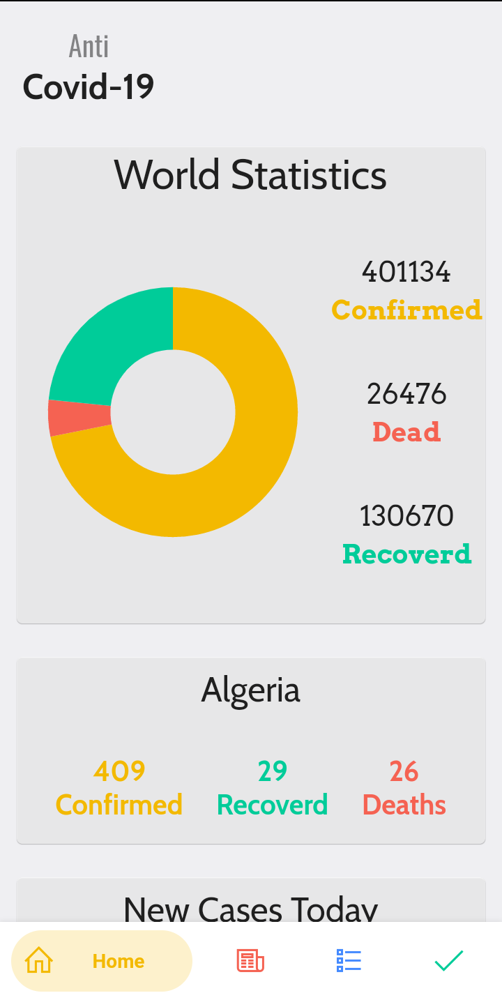
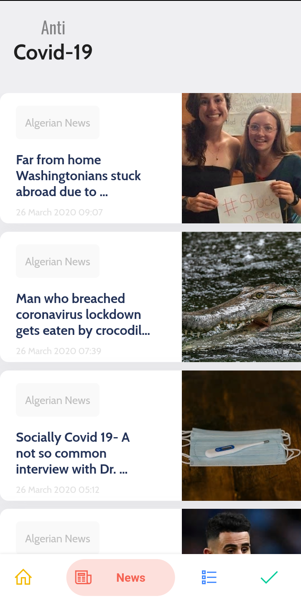
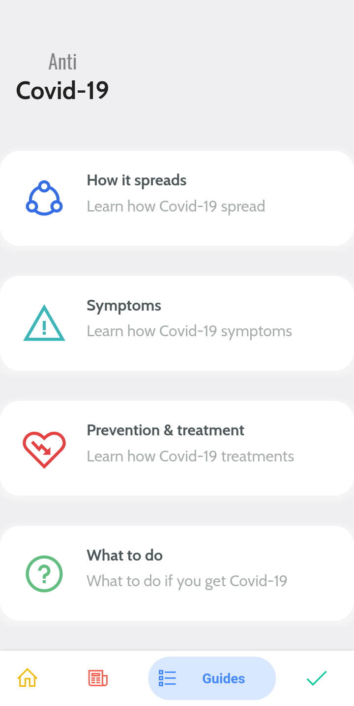
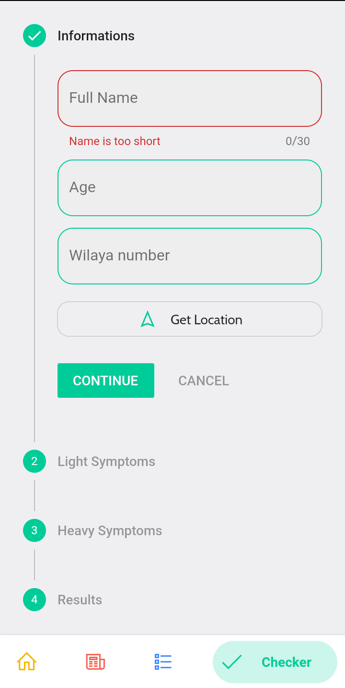
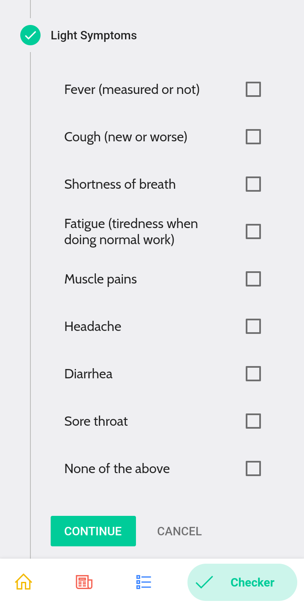
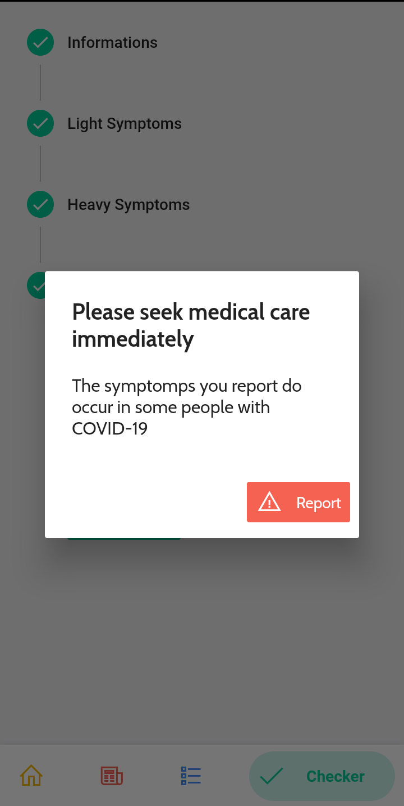

 
 
<h1 align="center">
   
  
   
  ANTI COVID-19 , Let's beat this pandemic
   
</h1>
 
<h4 align="center">A (local) app to track and have all kind of information to COVID19 virus this app was  made using flutter <a href="https://flutter.dev" target="_blank">Flutter</a>.</h4>

  
 
 

  <a href="#key-features">Key Features</a> •
  <a href="#how-to-use">Credit</a> •
  

<h4 align="center">Screenshots</h4>

  
   
   
   
   
  
    

 
## Key Features
 
* Charts and numbers for both worldwide and local(ALGERIA) COVID-19 stats
* Get the latest news when it comes to this virus
* Read guides and get informed of ways to protect your self and your closest
* Check your symptomps and see if there is anything to worry about
* Report a potential COVID19 case to get medical care needed after checking the symptomps Contains(Personal information,GPS location,symptomps)
 
 
## Credit
 
* The api used is [thevirustracker](https://thevirustracker.com) for stats and news  
* [CDC.gov](CDC.gov) 
 
 
> GitHub [@alaaedaouimeur](https://github.com/alaaedaouimeur)  · 
> Instagram [@x.alaaaouimeur.x](https://www.instagram.com/x.alaaaouimeur.x/)
